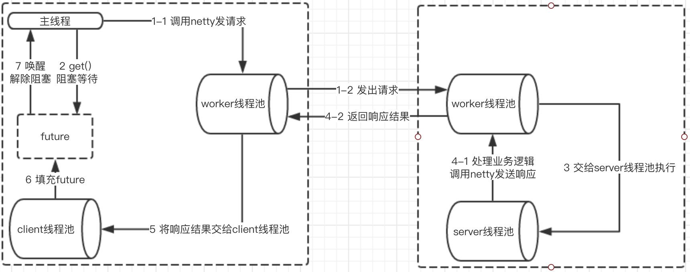

# Thread Model

## Thread Model

* If events handing can be executed quickly without sending new request like marking in memory. Events should be handled by I/O thread since it reduces thread dispatching.
* If event handling will be executed slowly or needs to send new I/O request like querying from database, events should be handled in thread pool. Otherwise, I/O thread will be blocked and then will be not able to receive requests.
* If events are handled by I/O thread, and send new I/O requests during the handling like sending a l login request during connect event, it will alert with “Potentially leading to deadlock”, but deadlock will not happen actually.


Thus, we need different dispatch strategies and different thread pool configurations to face difference scenarios. 

```xml
<dubbo:protocol name="dubbo" dispatcher="all" threadpool="fixed" threads="100" />
```

## Dispatcher

* all: All messages will be dispatched to thread pool, including request, response, connect event, disconnect event and heartbeat. 
* direct: All messages will not be dispatched to thread pool and will be executed directly by I/O thread.
* message: Only request, response messages will be dispatched to I/O thread. Other messages like disconnect, connect, heartbeat messages will be executed by I/O thread.
* execution: Only request message will be dispatched to thread pool. Other messages like response, connect, disconnect, heartbeat will be directly executed by I/O thread.
* connection: I/O thread will put disconnect and connect events in the queue and execute them sequentially, other messages will be dispatched to the thread pool.

## Thread pool

* fixed: A fixed size of thread pool. It creates threads when starts, never shut down.（default).
* cached: A cached thread pool. Automatically delete the thread when it’s in idle for one minute. Recreate when needed. 
* limit: elastic thread pool. But it can only increase the size of the thread pool. The reason is to avoid performance issue caused by traffic spike when decrease the size of the thread pool.

## Thread call graph

The default configuration, for example, a service call thread model diagram:


### Thread pool
In the provider side, there are three thread pool:

* Boss: thread pool netty all, contains only a NioEventLoop by default.Used to receive the client connection channel, and to channel after registration to the worker thread in the pool a NioEventLoop (which is actually registered on the Selector NioEventLoop have);
* Worker thread pool: all netty, default in dubbo contains "nuclear number + 1" NioEventLoop (default is 2 * auditing in netty).Worker thread in the pool every NioEventLoop block (Selector. The select ()) for registration on the channel ready event, then make the corresponding processing;
* Server thread pool: dubbo server-side business thread pool, the default worker thread will be decoded the request message to the thread pool for processing。

On the consumer side, there are two thread pool：

* The worker thread pool: worker thread pool with the provider.
* The client thread pool: dubbo server-side business thread pool, the default worker thread after decoding the response message will be passed on to the thread pool for processing.

### Communication process
From the point of view of threading model process of communication.For synchronous invocation (for example)

* The consumer end user thread before making a request to create a DefaultFuture object;Object and requestID as DefaultFuture key stored in ` ` ` Map < Long, DefaultFuture > FUTURES ` ` ` in (note: each requestID is a unique identifier, request the corresponding Response Response responseID equals the requestID);
* Called after netty coding and requests, and then immediately call DefaultFuture# get are blocked waiting (blocked waiting for a response is not null conditions);
* The provider side netty - after the server receives the request, decoding, and then passed on to the server thread pool for processing;
* Netty server thread pool after processing is completed, call code and sends a response message to the consumer end;
* cOnsumer end after the response is received, decoding, and then handed over to the client thread pool, the client thread pool from ` ` ` Map < Long, DefaultFuture > FUTURES ` ` ` extract key = responseID DefaultFuture object, and then the response after the news to fill in the response attribute, arouse the consumer end user threads blocked;
* The final consumer response are obtained.

