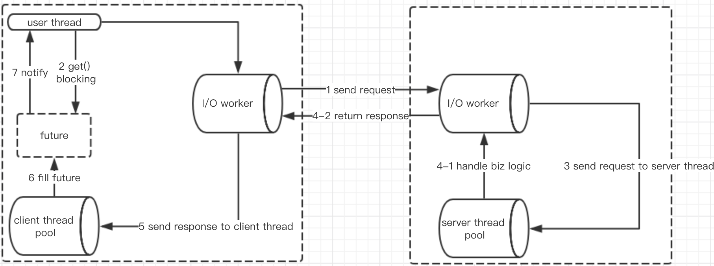

# 线程模型

如果事件处理的逻辑能迅速完成，并且不会发起新的 IO 请求，比如只是在内存中记个标识，则直接在 IO 线程上处理更快，因为减少了线程池调度。  

但如果事件处理逻辑较慢，或者需要发起新的 IO 请求，比如需要查询数据库，则必须派发到线程池，否则 IO 线程阻塞，将导致不能接收其它请求。  

如果用 IO 线程处理事件，又在事件处理过程中发起新的 IO 请求，比如在连接事件中发起登录请求，会报“可能引发死锁”异常，但不会真死锁。


因此，需要通过不同的派发策略和不同的线程池配置的组合来应对不同的场景:

```xml
<dubbo:protocol name="dubbo" dispatcher="all" threadpool="fixed" threads="100" />
```

Dispatcher

* `all` 所有消息都派发到线程池，包括请求，响应，连接事件，断开事件，心跳等。
* `direct` 所有消息都不派发到线程池，全部在 IO 线程上直接执行。
* `message` 只有请求响应消息派发到线程池，其它连接断开事件，心跳等消息，直接在 IO 线程上执行。
* `execution` 只请求消息派发到线程池，不含响应，响应和其它连接断开事件，心跳等消息，直接在 IO 线程上执行。
* `connection` 在 IO 线程上，将连接断开事件放入队列，有序逐个执行，其它消息派发到线程池。

ThreadPool

* `fixed` 固定大小线程池，启动时建立线程，不关闭，一直持有。(缺省)
* `cached` 缓存线程池，空闲一分钟自动删除，需要时重建。
* `limited` 可伸缩线程池，但池中的线程数只会增长不会收缩。只增长不收缩的目的是为了避免收缩时突然来了大流量引起的性能问题。
* `eager` 优先创建`Worker`线程池。在任务数量大于`corePoolSize`但是小于`maximumPoolSize`时，优先创建`Worker`来处理任务。当任务数量大于`maximumPoolSize`时，将任务放入阻塞队列中。阻塞队列充满时抛出`RejectedExecutionException`。(相比于`cached`:`cached`在任务数量超过`maximumPoolSize`时直接抛出异常而不是将任务放入阻塞队列)

以默认的配置为例，给出一张服务调用的线程模型图：


###线程池
在provider端，存在三个线程池：

* boss线程池：netty所有，默认只包含一个NioEventLoop。用于接收客户端的连接channel，并且之后将channel注册到worker线程池中的一个NioEventLoop上（实际上是注册在NioEventLoop所拥有的那个Selector上）；
* worker线程池：netty所有，在dubbo中默认包含“核数+1”个NioEventLoop（在netty中默认是2*核数）。worker线程池中的每一个NioEventLoop去阻塞（Selector.select()）获取注册在其上的channel准备就绪的事件，然后做出相应处理；
* server线程池：dubbo服务端的业务线程池，默认worker线程会将解码后的请求消息交由该线程池进行处理。

在consumer端，存在两个线程池：

* worker线程池：同provider的worker线程池。
* client线程池：dubbo服务端的业务线程池，默认worker线程会将解码后的响应消息交由该线程池进行处理。

###通信流程
从线程模型的角度来看通信流程。（以同步调用为例）

* consumer端用户线程在发出请求之前会先创建一个DefaultFuture对象；并将requestID作为DefaultFuture对象的key存储在```Map<Long, DefaultFuture> FUTURES```中（注意：每一个requestID是一个请求的唯一标识，最后相应的响应Response的responseID就等于这个requestID）
* 之后调用netty编码并发出请求，然后马上调用DefaultFuture#get进行阻塞等待（阻塞等待response不为空的条件）；
* provider端netty-server接收到请求后，解码，然后交由server线程池进行处理；
* server线程池处理完成之后，调用netty编码并发送响应消息给consumer端；
* consumer端接收到响应后，解码，然后交给client线程池处理，client线程池从```Map<Long, DefaultFuture> FUTURES```中获取key=responseID的DefaultFuture对象，然后将响应消息填充到其response属性后，唤醒consumer端阻塞的用户线程；
* 最后consumer得到了响应。
